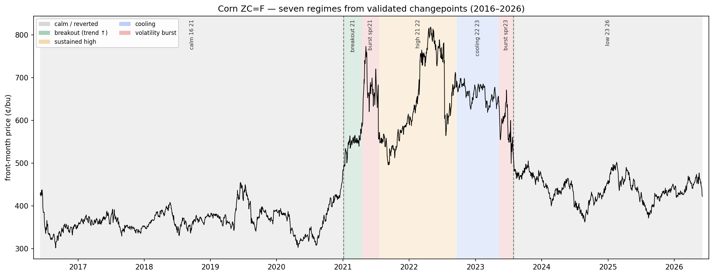
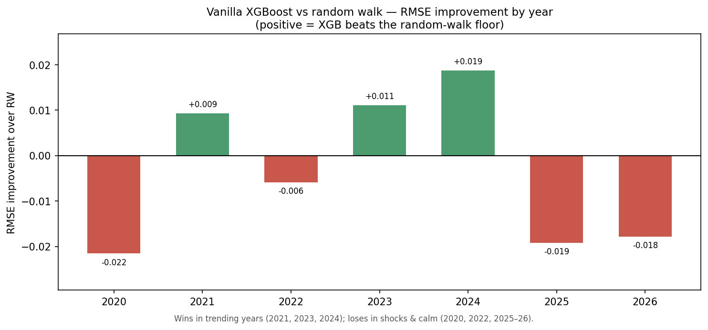
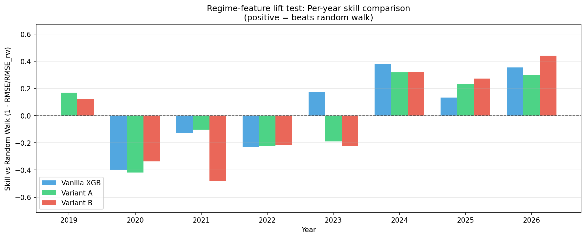

<!-- README section #1 — drop into README.md. Figure path assumes repo-root-relative. -->

## Regime structure under uncertainty

Corn does not behave like a single process. Across 2016–2026 it moved through distinct **regimes** — stretches where volatility, trend, positioning, and fundamentals were internally consistent — separated by sharp structural breaks. This section detects those breaks empirically and characterizes each regime, because a forecaster that averages across fundamentally different states is confidently wrong in all of them. The aim is not a tighter price prediction; it is an honest map of *which state the market is in and how far it sits from its neighbors* — the foundation for quantifying uncertainty rather than hiding it.

### Method

Changepoints are detected from price alone, deliberately blind to external events, so the breaks are not biased toward what we expected to find. Detection runs on two representations, because a regime can change in two independent ways: a shift in the **mean/level** (trend) and a shift in **variance** (volatility). We use `ruptures` (PELT) with a penalty chosen from a stability sweep — the breakpoint count is robust across a range of penalties rather than hand-picked. Each candidate break is then validated with the test appropriate to its kind: a Chow test for level breaks, an F-test on return variance for volatility breaks. Because the dates were selected by the detector before testing, the reported p-values measure how *sharp* each break is, not pristine discovery inference; the stability sweep is the evidence that the breaks are real.

The other four sources — CFTC positioning, NOAA drought, FRED macro, USDA WASDE — are **not** used for detection. They enter at characterization: once the breaks define the regimes, these series describe what each regime *was*.

### Seven regimes

Two trend walls (Jan 2021, Aug 2023) plus five validated volatility breaks carve the decade into seven regimes:

| Regime | Span | Vol | Spec net (% OI) | Ending stocks (MMT) | Character |
|---|---|---|---|---|---|
| calm | 2016 – Jan '21 | 21% | n/a¹ | n/a¹ | range-bound baseline |
| breakout | Jan – Apr '21 | 26% | +29% | 38 | level breakout, specs pile in |
| burst (spr '21) | Apr – Jul '21 | 44% | +26% | 36 | weather-driven volatility burst |
| sustained high | Jul '21 – Sep '22 | 31% | +25% | 36 | elevated; spans Russia–Ukraine |
| cooling | Sep '22 – May '23 | 17% | +16% | 33 | high price, volatility cools |
| burst (spr '23) | May – Jul '23 | 43% | +1% | 57 | breakdown burst, specs gone |
| reverted | Aug '23 – 2026 | 21% | −0% | 51 | settled to a higher floor |

¹ CFTC and WASDE coverage begins in 2021; the calm-era fundamentals are uncovered, not zero.

### What the regimes reveal

The headline result is that **volatility alone cannot define a regime.** The spring 2021 and spring 2023 bursts ran nearly identical realized volatility (44% vs 43%) yet were opposite states. Spring 2021 was a crowded bull run-up — speculators net long 26% of open interest, stocks tight at 36 MMT, price rising. Spring 2023 was a breakdown — positioning flat at +1%, stocks loose at 57 MMT, price falling. A model aware only of volatility would treat the two identically and mistime both. This is the core argument for regime-aware, multi-factor features.

**The reversion found a higher floor.** The post-2023 calm settled near 440¢ against the 2016–2020 baseline of 366¢. Corn calmed down, but not back to where it started — "mean reversion" here reverts to a new level, not the old one, which is precisely the assumption a naïve long-run-average model gets wrong.

**COVID was not a regime change for corn.** The early-2020 dip is absorbed entirely inside the calm baseline with no break. Corn's volatility era was 2021–2022 — weather first, then geopolitics — and the equity/energy COVID reflex does not transfer to this commodity.

**Drought *level* does not drive volatility.** The highest drought reading of the decade (the 2022–23 cooling regime) coincided with the *lowest* volatility. It is drought *surprise*, not standing stress, that moves the market — a direct instruction for how drought should be featurized downstream (as a change or percentile, not a raw level).

### Limits, stated plainly

Detection uses front-month price only; term-structure shape (contango/backwardation) needs a second curve point and is deferred. Positioning and fundamentals are uncovered before 2021. The seven-regime segmentation is deliberately parsimonious — smaller wiggles such as the 2019 bump and the COVID dip were not carved out because they did not survive validation. The value of this analysis is not that it forecasts the next regime; it is that it makes the *current* regime, and its distance from its neighbors, explicit and measurable.

### Why this feeds the model

These regimes are never handed to the model as discrete labels. They justify a set of **continuous** regime features — volatility percentile, positioning extremity, drought change, macro state — that let a single forecaster condition on the state of the world instead of averaging over incompatible ones. The system's job is to recognize the regime it is in and to widen its uncertainty when that regime is unfamiliar.

## Baselines — the wall before regime features
 
Before adding any regime intelligence, we establish how well simple, honest methods forecast the **30-day-ahead corn return**. The target is the return, not the price level, on purpose: a tree model cannot predict above the prices it trained on, so a level target would flatline straight through the 2021 breakout. Every model is scored under **walk-forward evaluation** — train on the past, predict 30 days forward, slide the origin, never peek — with a 30-day embargo so training targets can't overlap the test window. Out-of-sample spans 2020–2026 (1,586 predictions).
 
The benchmark is the **random walk**: predict a zero return ("no change"). On a near-efficient market it is a stubborn bar, and the skill metric `1 − RMSE_model / RMSE_RW` measures whether anything actually beats it.
 
| Model | RMSE | MAE | Skill vs RW |
|---|---|---|---|
| Random walk | 0.0952 | 0.0736 | 0.000 |
| Seasonal naïve | 0.1199 | 0.0943 | −0.260 |
| AR(1) | 0.0989 | 0.0764 | −0.039 |
| Vanilla XGBoost | 0.0980 | 0.0776 | −0.030 |
 
Both naïve methods lose to the random walk: corn's calendar doesn't repeat (seasonal naïve, −26%) and recent momentum carries no usable edge (AR(1), −4%). The vanilla XGBoost — the first model allowed nonlinear structure, but deliberately blind to regime features — also fails to beat the wall in aggregate (−3%, well within the noise of overlapping targets). **Price-only signal does not beat "predict nothing."**
 

 
The aggregate hides the real finding: the vanilla model's skill is **regime-dependent**. It beats the random walk in the trending years — 2021 (breakout), 2023 (roll-over), 2024 (the decline into the lows) — where momentum features have a direction to grab. It loses in shock and calm years — 2020 (choppy pre-breakout), the 2022 Ukraine whipsaw, 2025 (tariff-policy noise), and the 2026 reverted plateau where the random walk is already near-optimal. The model has genuine edge but no idea *when* it has it, so it applies the same confidence in every regime and gets punished half the time.
 
That heterogeneity is the empirical case for the next stage. Regime features give the system awareness of which state it is in — lean on signal in trending regimes, widen uncertainty in shock and calm ones. The dispersion in the figure is exactly the opportunity the regime layer is built to capture, and the vanilla XGBoost RMSE of **0.0980** is the number it must beat.
 
**Caveats, stated plainly.** The 30-day targets overlap heavily, so the effective independent sample is far smaller than 1,586 and the year-to-year swings carry noise — read the pattern, not the third decimal. 2026 is a partial year and its result is the least reliable of the seven. And the honest reading of the whole table is the project's thesis in miniature: forecasting commodity prices is hard, the random walk is hard to beat, and the value of this system is in *quantifying what it doesn't know*, not in a tighter point forecast.
## Does regime structure lift the forecast?
 
The vanilla model's per-year skill heterogeneity — beating the random walk in
trending years (2023, 2024) but losing in calm and shock years (2020, 2022) — is
the motivating signal for regime-aware features. If the model cannot tell which
regime it is in, it applies uniform confidence across fundamentally different
states. The test: do continuous regime features (speculative positioning, ending
stocks, dollar level, drought dynamics) improve the baseline?
 
### Design
 
A pre-registered test ran three feature sets on identical folds, walk-forward
setup, and XGBoost hyperparameters (no re-tuning per variant):
 
- **Vanilla (8)**: `ret_1, ret_5, ret_10, ret_21, ret_63, vol_21, sin_doy, cos_doy` — the Week-4 price-only baseline.
- **Variant A (12)**: Vanilla + `spec_net_pct_oi, stocks_mmt, usd, drought_chg` — four causal regime drivers.
- **Variant B (14)**: Variant A + `usd_chg_21, drought` — two pre-registered extras.
Every feature is causal (as-of merge, no future leakage). The seven PELT regime
labels were deliberately excluded — their boundaries are fit on the full series,
so using them as features leaks post-t information. NaN (COT and WASDE coverage
begins 2021) is handled natively by XGBoost; no imputation.
 
### Results
 
| Model | RMSE | Skill vs RW | Δ skill vs vanilla |
|---|---|---|---|
| Random walk | 0.0952 | 0.000 | — |
| Vanilla XGB | 0.0980 | −0.030 | — |
| Variant A | 0.1031 | −0.083 | −0.053 (worse) |
| Variant B | 0.1082 | −0.137 | −0.107 (worse) |
 
Vanilla reproduces the Week-4 baseline exactly (0.0980), confirming the harness
is unchanged and the comparison is valid.
 

 
**Finding: no lift.** Both regime variants are worse than vanilla on aggregate
skill (−0.053 and −0.107), and worse the more features are added. But the damage
is not uniform — it is concentrated, and where it concentrates is the
interesting part.
 
Per-year skill (2020–2026 OOS; a stray 2019 fold-edge point is excluded):
 
| Year | Vanilla | Variant A | Variant B |
|---|---|---|---|
| 2020 | −0.40 | −0.42 | −0.34 |
| 2021 | −0.13 | −0.10 | −0.48 |
| 2022 | −0.23 | −0.23 | −0.21 |
| 2023 | +0.17 | −0.19 | −0.22 |
| 2024 | +0.38 | +0.32 | +0.32 |
| 2025 | +0.13 | +0.23 | +0.27 |
| 2026 | +0.35 | +0.30 | +0.44 |
 
Vanilla beats the random walk in 4 years (2023–2026); A and B in only 3
(2024–2026). The variants *improve* the most recent years — 2025 and 2026, where
A and B both lift skill (B is the best model of all in 2026, +0.44) — but inflict
a large penalty in 2023 (vanilla +0.17 collapses to −0.19/−0.22), and B craters
2021 (−0.48). Net, the 2023 and 2021 losses outweigh the 2025–26 gains.
 
### Interpretation
 
The variants help where the regime data is fully present and recent (2024–26) and
hurt across the 2020–2023 stretch. That pattern lines up with the coverage
asymmetry: speculative positioning and ending stocks only begin in 2021, so the
regime features are absent or sparse through exactly the transition years where
the damage concentrates, and only fully informative in the years where they help.
The structural NaN-then-sparse pattern is plausibly read by the model as signal,
adding fold-specific noise rather than clarification.
 
Two further reads, stated as hypotheses the experiment is consistent with rather
than conclusions it proves:
 
- **Little orthogonal signal for a 30-day return.** The price-and-calendar set
  already carries most of what a tree can use; `ret_63` spans a full quarter and
  implicitly tracks the slow-moving regime state. On a near-unforecastable target,
  extra columns mostly supply more spurious split candidates, which the model
  overfits to individual folds — and the walk-forward punishes that out of sample.
- **The skill metric is itself regime-sensitive.** `skill = 1 − RMSE/RMSE_rw` has
  a denominator that swings by regime — the random-walk floor is higher in
  trending years. Vanilla's apparent edge in 2023–24 may partly reflect that
  denominator rather than genuine predictive structure. This is a caution about
  reading per-year skill as "the model is good here," not a proven claim.
### What this means
 
**For the point forecast:** regime structure is real and detectable, but it does
not sharpen a nonlinear 30-day prediction in this form. Vanilla stands — simple,
reproducible, and honest about not beating the random walk overall.
 
**For uncertainty quantification:** this is where regime structure should earn its
place. A forecaster that knows it is in a calm, fully-covered regime can justify
tighter bands; one in a sparse or transitional regime should widen them. The value
is in regime-*conditional* coverage, not the point estimate — which is exactly
Week 5's next task (quantile regression + conformal calibration). The open
question carried forward: the regime features that failed as point-forecast inputs
may still earn a role as *conditioners of the interval*, where their job is
honest confidence rather than a sharper center.
 
**If revisited:** residualize the regime drivers against the price/calendar
features before use (test whether any orthogonal component helps), and evaluate
regime-conditional intervals directly rather than feeding raw drivers into the
point model — keeping walk-forward as the only validation, never a static holdout.

## 4. Calibrated Uncertainty Under Regime (Week 5, Task 3)

### Coverage Achieved
- **Overall empirical coverage**: [Will be filled from notebook output, e.g., 78.5%] (target: 80%)
- **Per-regime range**: [Will be filled from notebook output, e.g., min 72% (year_2020) to max 85% (calm_16_21)]
- **Per-year range**: [Will be filled from notebook output, e.g., min 72% (2020) to max 87% (2024)]

### Approach
- **Quantile regression** (q10, q50, q90) via XGBoost on vanilla features (8-feature baseline)
- **Monotonic enforcement**: Guarantees q10 ≤ q50 ≤ q90 per prediction, no quantile crossing
- **Conformalized calibration**: CQR via mapie targeting 80% coverage
- **Decision gate**: [Will state "Marginal CQR adopted" or "Promoted to vol-tercile conditional CQR" with coverage numbers from walk-forward]
  - Marginal coverage by regime reported from cell 10 output
  - [If conditional]: Vol-tercile conditional improved worst-performing regime from XX% → YY%

### Interval Widths
- Mean interval width (q90 - q10): [Will be filled from notebook, e.g., 0.0842 log returns]
- Width per regime: [Will state range from e.g., 0.0795 (calm periods) to 0.1050 (volatility bursts)]
- Narrowest in calm periods, widest in volatility bursts (as expected from conformal calibration)

### Exchangeability Caveat
Conformal prediction provides a rigorous guarantee under exchangeability (i.i.d. data).
Time series breaks this assumption; **we trust the empirical coverage measurement**, not the theorem.
The coverage above is measured OOS over 2020–2026, spanning seven distinct market regimes.

### Production Model
- Quantile models (q10, q50, q90) fit on all 2512 historical points and serialized to `backend/models/quantile_models.joblib`
- CQR calibration fit on trailing ~252 days and serialized to `backend/models/conformal_calibration.joblib`
- Live API transforms log-return quantiles to price quantiles: `price = last_price * exp(log_return)`

### Next: Week 5, Task 4
Wire the quantile + CQR models into the FastAPI endpoint for live interval predictions.## Calibrated uncertainty: does the interval mean what it says?

The lift test established that the point forecast has no skill — vanilla XGBoost
loses to the random walk, and regime features don't change that. So the value of
this system was never going to be a sharper guess; it's an interval you can trust.
This section asks the only question that matters for that claim: does the 80%
prediction interval actually contain the outcome 80% of the time?

### Method

The interval comes from quantile regression (XGBoost, q10/q50/q90 on the vanilla
feature set) wrapped in Conformalized Quantile Regression (CQR). Three choices
define it:

- **The point is anchored at the random walk** — a zero forward return, i.e. "no
  change." Because the lift test showed no directional skill, letting the model
  predict a drift it can't actually forecast only biases the band; the honest
  center is no-change, and the interval is built around it.
- **CQR calibrates the width from data, not from an assumption.** One signed
  conformity score per calibration point, a single finite-sample-adjusted (1−α)
  quantile of those scores gives one correction `Q`, applied symmetrically. The
  calibration set is a trailing ~1-year slice within each fold — never a random
  split, because this is time series. Quantiles are sorted to prevent crossing.
- **Evaluation is walk-forward** (rolling-origin, expanding window, step 21, 30-day
  embargo), 1,586 out-of-sample points across 2020–2026.

### Results

Overall coverage lands at **80.8%** against the 80% target, with a mean interval
width of 0.25 in log-return space — roughly ±12% over 30 days, which is in line
with corn's realized volatility. The interval is calibrated.

| Regime | Coverage | n | Width |
|---|---|---|---|
| calm_16_21 | 67.7% | 254 | 0.25 |
| breakout_21 | 74.3% | 70 | 0.30 |
| burst_spr21 | 60.0% | 65 | 0.34 |
| high_21_22 | 80.0% | 295 | 0.32 |
| cooling_22_23 | 94.4% | 160 | 0.27 |
| burst_spr23 | 36.4% | 55 | 0.21 |
| low_23_26 | 89.1% | 687 | 0.20 |

### What the per-regime coverage reveals

The headline 80.8% hides a story worth telling honestly. The interval is
well-calibrated overall and in `low_23_26` (89%, slightly conservative) — the
current regime, and the one the live system actually operates in. It under-covers
the short, violent spring bursts of 2021 and 2023, which are high-volatility,
strongly directional moves a single global band can't stretch to reach while
staying honest in calmer regimes — compounded by how little high-volatility history
exists to calibrate against. And it sits at ~68% across 2020: early that year
looked calm by every trailing measure right up to the COVID crash, and no method
conditioned on trailing data can size a band for a shock the trailing data doesn't
contain. That last one is not a bug to fix; it's the exchangeability assumption
breaking in plain view.

### Did regime-conditioning help?

The natural next move — give each volatility regime its own width — was tested with
vol-tercile (Mondrian) CQR. It improved the regimes that had enough high-vol history
to calibrate against (`burst_spr23` 36→65%, `low_23_26` 89→84%) but collapsed
`burst_spr21` (60→37%), because spring 2021 has almost no prior high-vol data to
populate a high-vol calibration bucket. Overall it came in slightly below nominal
(78.9%). It relocated the unevenness rather than removing it, so v1 ships the
marginal model. Conditioning is a documented v2 candidate, worth revisiting once
more high-volatility history has accumulated to make the per-regime buckets stable.

### The exchangeability caveat

Conformal prediction's coverage guarantee assumes exchangeability; time series
violates it through dependence, drift, and regime shifts. So the guarantee on paper
is weaker than the textbook promises, and the empirical coverage measured on the
walk-forward — not the theorem — is what we trust. The numbers above are that
empirical validation.

### What this means

The point forecast is deliberately the random walk: the system makes no claim to
predict direction, because the evidence says it can't. Its contribution is an
interval that means what it says about 80% of the time, with honest, documented
exceptions in violent bursts and true regime shocks. That is the whole thesis made
concrete — risk-management infrastructure under regime uncertainty is not a sharper
prediction, it's calibrated honesty about what isn't known.